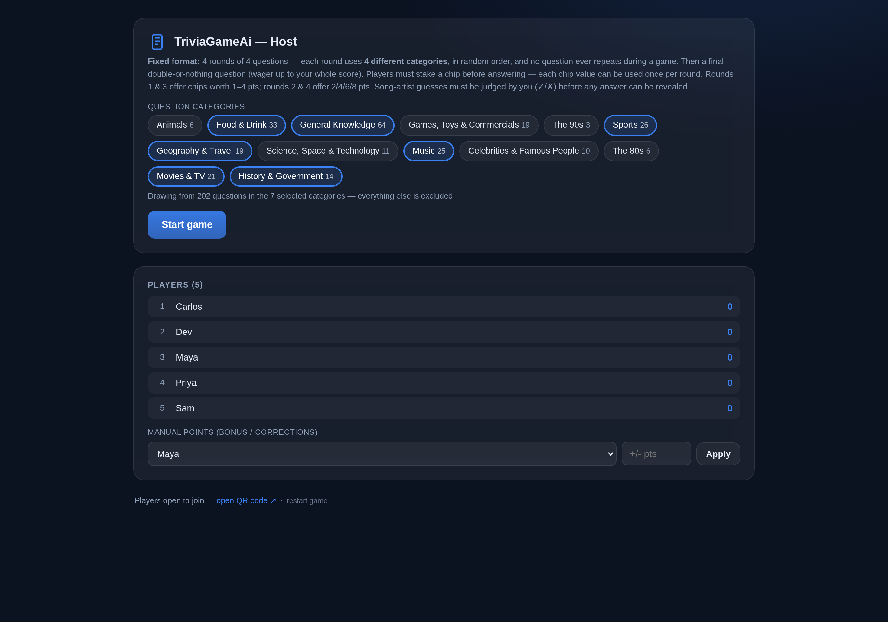
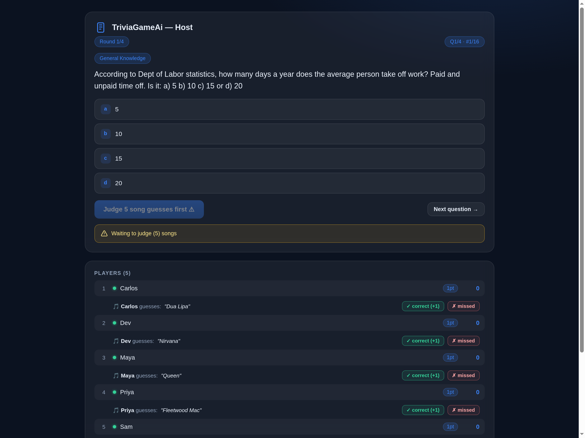
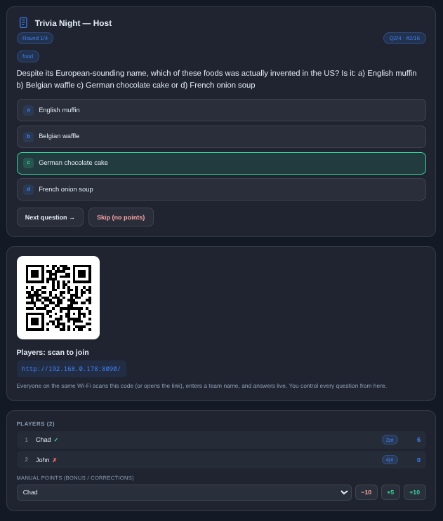
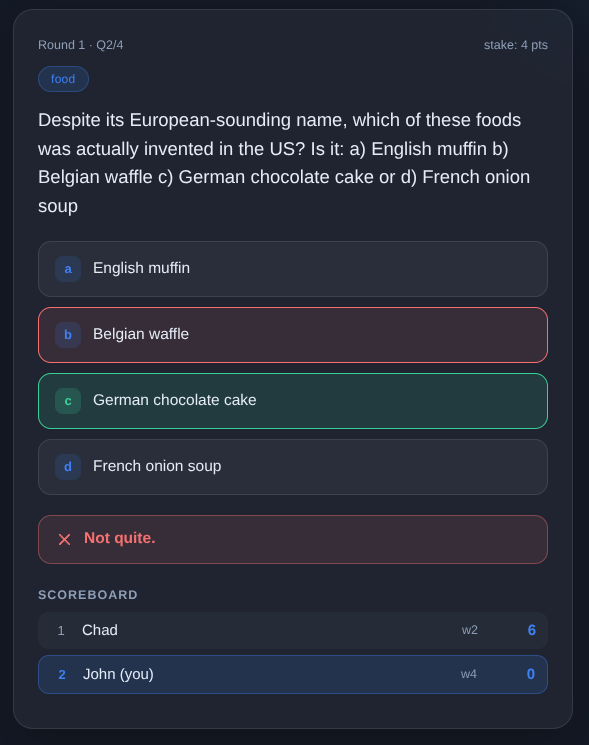
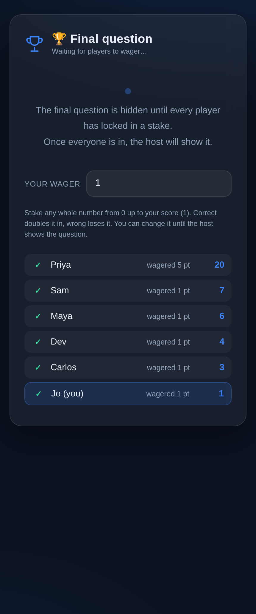

# AiTriviaGame — live trivia for restaurants & bars

A self-contained Node.js + Socket.IO app for running **trivia night at a restaurant or
bar**. One device acts as the **host** (controls questions, reveals answers, awards
points); players join from their phones by scanning a **QR code** or opening the link —
no shared network needed if you expose the server with a public URL. Everything updates
in real time.

Built for the venue: the **song coming out of the house system between questions is part
of the game**. While the music plays, players type the **artist** into a bonus box on
their phone — name it and the host confirms it for **+1 point**. See
[The venue song](#the-venue-song-1-bonus-point).

## What's inside

- **200+ multiple-choice questions** (257 shipped in `trivia_sorted_categories.json`),
  sorted into **13 categories** — General Knowledge, Food & Drink, Sports, Music,
  Movies & TV, Games/Toys & Commercials, Geography & Travel, History & Government,
  Science/Space & Technology, Celebrities, Animals, The 80s and The 90s.
- **Fixed game format**: **4 rounds × 4 questions** + one final double-or-nothing
  question. The structure never changes — the host picks which **categories** the game
  draws from before starting.
- **Per-question wagering** instead of fixed points — chip values can each be used once
  per round.
- **The venue song bonus**: players guess the artist of whatever the venue is playing
  between questions.
- Join by QR code, no accounts, no build step.

## Installation & running (3 steps)

You only need **[Node.js](https://nodejs.org)** installed — that's the one prerequisite.
Check it with `node -v` in a terminal (any recent version works).

### Step 1 — Get the code

Either download this repo as a ZIP from GitHub, or clone it:

```bash
git clone https://github.com/ChainTrick/TriviaGameAi.git
cd TriviaGameAi
```

(If you downloaded a ZIP instead, just open that folder in your terminal.)

### Step 2 — Install the dependencies

Run this once inside the project folder:

```bash
npm install
```

### Step 3 — Start the game server

```bash
node server.js
```

That's it! The server listens on port **8090** and prints:

- Host page : `http://<LAN-IP>:8090/host` (or your `PUBLIC_URL`/host path if set) ← open this on your host device (laptop/phone)
- Players   : the join URL, e.g. `https://your-public-url.example.com/` — shown as a link on the host page

**On the night**: open the host page on the laptop or tablet behind the bar (or on the
host's phone), pick the categories, press **Start game**, and display or call out the
join link (or tap **Show QR code** to put the QR on a screen / print it for tables).
Players join from anywhere and play between ordering and eating — no app, no account.

## The venue song (+1 bonus point)

This is the part that ties the game to the room you're in:

- Between questions the restaurant/bar plays a song over the house system (whatever the
  venue's playlist, DJ or jukebox is playing).
- On their phone, at the bottom of every question, each player gets a
  **"+1 Bonus Point if you know the artist of the song playing"** box — they type the
  **artist** (max 30 characters) and hit **Send**. One guess per player per question.
- The bonus is completely separate from the multiple-choice question — it counts whether
  the player gets the main question right or wrong.
- The host's player list shows every guess next to the player's name, with **✓ correct
  (+1)** and **✗ missed** buttons. The host judges honestly against whatever is playing
  in the venue (song-recognition apps make this quick).
- **The answer stays hidden until every pending song guess is judged.** The host panel
  shows a short "Waiting to judge (N) songs" notice and Reveal stays locked until the
  queue is clear.
- The player immediately sees "You got the song artist right! +1 point" or "Sorry, you
  missed the song artist."

## Screenshots

**Host — setup screen.** The game is always 4 rounds of 4 questions; the host only
chooses which categories it draws from:



**Host — in a question, judging the venue's song guesses.** Each player's artist guess
sits under their name with **✓ correct (+1)** / **✗ missed**; the notice below the
question shows how many are still waiting, and **Reveal stays locked** until the queue
is clear:



**Host — reveal / scoreboard.** Correct answer highlighted, every player's result and
live score on the board:



**Player (phone) — the question screen.** Wager chips at the top, answer options, and the
song-artist bonus box at the bottom for the track the venue is playing:



**Player (phone) — final question wager screen.** The final question stays hidden
while players stake up to their whole score; its **category** is shown on the screen,
and the board shows who has locked in:



## How a game works

The format is **fixed**: **4 rounds × 4 questions = 16 multiple-choice questions**, then
one final double-or-nothing question. Rounds and questions-per-round are **not**
configurable — every game is the same shape so it fits a trivia-night slot.

1. Host picks which **categories** the game draws from (or leaves it on **all** for the
   full spread) → **Start game**. Each round uses a different set of categories in random
   order, and no question ever repeats during a game.
2. Players see "waiting" until the first question is sent; they pick their **wager**
   (required — no stake means the question is forfeited), type/pick an answer, then
   lock it in before time runs out.
3. Host presses **Reveal** — correct answers are highlighted for everyone, points
   update live on every screen (host scoreboard + player boards).
4. **Next** advances to the next question. The game flows straight into round 2 —
   after any later round's last question it pauses at a **"Round complete"** break
   and the host presses **Start next round** when ready (players see the same break
   with live standings).
5. After the final round, one **final question** is played: each player may wager
   any whole number of points from 0 up to their current score (double-or-nothing —
   correct adds it, wrong subtracts it). The wager screen shows the question's
   **category** while the text stays hidden; once the host reveals the question the
   stake is locked and can no longer be changed. Then the game ends and final
   standings show to everyone.

Throughout, players can drop a **song-artist guess** for the +1 bonus (see above). The
host can also award **manual bonus points** — any positive or negative amount, via
**Manual points** on the player panel. Keyboard shortcuts on the host page: `R` =
reveal (blocked while song guesses are waiting), `N`/Enter = next / start next round.

## Wagering & scoring

Each question is worth whatever a player stakes, not a fixed amount:

- Before answering, each player picks a **wager** (tap a chip). Odd rounds offer
  chips **1–4**; even rounds (2, 4) offer **2 / 4 / 6 / 8**.
- Each chip value can only be used **once per round** — whether the answer was
  right or wrong. Once you've staked your "2" on any question in a round it's
  spent and greyed out for the rest of that round; the pool resets at the start
  of every new round (and when a new game starts).
- You may change your pick freely *within* the current question; the chip is only
  locked in when the host reveals.
- **A stake is required**: players must pick a chip before they can answer — no
  stake means the question is forfeited (nothing gained or lost either way).
- **Correct → +wager**, **wrong → no penalty** in rounds 1–4.
- The **song-artist bonus** is worth a flat **+1**, independent of the wager and of
  whether the main question was answered correctly.
- After all rounds there is one **final question**: each player may wager any whole number of points from **0 up to their current score**. It's double-or-nothing — correct adds the stake, wrong subtracts it (you can't go below 0).

So a confident player can swing big (+8 on an even round) while a cautious one plays
it safe (+1). The host panel shows every player's live stake and ✓/✗ result per question.

## Question file

Questions load from `trivia_sorted_categories.json` in this folder — **257 multiple-choice
questions across 13 categories**, all in the repo. To use a different file, set the `QUESTIONS_FILE` env var or edit
the `QUESTIONS_FILE` constant at the top of `server.js`.

## Running it as a background service (Linux)

You can run the server as a systemd **user** service so it auto-starts on login.
Create `~/.config/systemd/user/triviagame.service` with your own paths and URL:

```ini
[Unit]
Description=AiTriviaGame — trivia game server
After=network-online.target
Wants=network-online.target

[Service]
Type=simple
WorkingDirectory=/path/to/this/folder
Environment=PORT=8090
# Optional: set your public URL here so the QR code points at it.
# Environment=PUBLIC_URL=https://your-public-url.example.com
ExecStart=/usr/bin/node server.js
Restart=on-failure
RestartSec=3

[Install]
WantedBy=default.target
```

Then install and start it:

```bash
systemctl --user daemon-reload
systemctl --user enable --now triviagame     # start now + auto-start on login
```

Manage it with:

```bash
systemctl --user status triviagame          # is it running?
journalctl --user -u triviagame -f          # live logs (Ctrl-C to stop watching)
systemctl --user restart triviagame         # apply changes / bounce the server
systemctl --user stop triviagame            # stop it
```

> Note: a user service only runs while your account is logged in. If you want it to
> survive logout, either keep a session open or move the unit to
> `/etc/systemd/system/` (root) and adjust `WorkingDirectory` accordingly.

## Public URL / QR code

The host page's QR encodes whatever `PUBLIC_URL` is set to:

- **LAN only** (default): no env var → QR uses your LAN IP, e.g. `http://192.168.x.x:8090/`.
- **Public**: set `PUBLIC_URL=https://your-public-url.example.com` so players on other
  networks can join through whatever tunnel or reverse proxy you use (Cloudflare
  Tunnel, Tailscale serve/funnel, etc.).

To change it, edit the `Environment=PUBLIC_URL=...` line in your installed unit and run
`systemctl --user daemon-reload && systemctl --user restart triviagame`.

## Endpoints

| Path | What it is |
|------|-----------|
| `/`      | Player page (what phones load from the QR) |
| `/host`  | Host control panel + join link / "Show QR code" button |
| `/qr`    | Standalone QR popup page (opened in a new window by the host) |
| `/qr.png`| The join QR as a PNG (800px, for printing) |
| `/join-info` | JSON with the current join URL (used by `/qr`) |

## Tests

```bash
node test-e2e.mjs        # needs the server running; simulates host + 2 players end-to-end
node test-full-game.mjs  # full default game (4 rounds x 4 questions + final question)
```

`test-e2e.mjs` covers: joining (+ join-ack), lobby, full game flow (automatic advance
into round 2 and a host pause after later rounds), per-round wager options
(1–4 on odd rounds, 2/4/6/8 on even rounds), chip pick / reuse rejection within
a round / per-round pool reset, the **required-stake rule** (no stake = forfeited question,
nothing gained or lost; answers without a stake earn nothing), scoring (correct adds the
stake, wrong never subtracts in rounds), the song-artist bonus guess and the reveal gate
that blocks **Reveal** until every pending guess is judged, manual point adjustments by the host (any positive
or negative amount), the final question (wager any amount up to your score — correct adds it,
wrong subtracts it; over-score wagers rejected), and disconnect/rejoin with score persistence.

`test-full-game.mjs` plays a complete default game end-to-end: required stakes on every
question, per-round chip reuse, forfeits, round-boundary pauses, the final question, and
final standings. Both suites pass fully.

## Built with local AI

This game was coded with **local AI models during an indie dev session** — no cloud
coding service, everything ran on one desktop:

- **CPU:** AMD Ryzen 7 5700X
- **GPU:** NVIDIA GeForce RTX 5060 Ti
- **LLM:** [LM Studio](https://lmstudio.ai) running `qwen3.8-27b-gsq-rco@iq3_s`
- **Agent:** [Hermes](https://hermes-agent.nousresearch.com/docs)

## Support the project — GitHub Sponsors

AiTriviaGame is free and stays free. If your restaurant or bar runs trivia night with it
and you'd like to say thanks, tips are welcome in crypto:

| Coin | Address |
|------|---------|
| **Monero (XMR)** | `869bsa5yxUG4x5GZdX1bVPEqHfGwwLN5VagfjZF8DQdq2iKfgxa56DmQVvDdcvQhaXcpyEL9QxGY14BUQn1VibaDRYwuQUM` |
| **Bitcoin (BTC)** | `bc1q540rxyahpl9rn2l00uuzvhuekx4tgyzdexqde2` |

No pressure at all — the best tip is using it on a busy Friday night.

## Notes

- Players keep their identity and score if they drop off and re-scan (rejoin by name).
- The host page shows live "answered" dots per player during a question.
- No accounts, no build step — just `node server.js`.